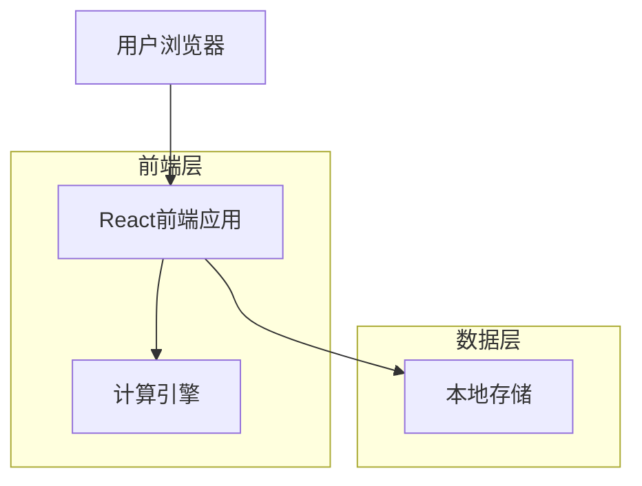

## 1. 架构设计



## 2. 技术描述

- **前端**: React@18 + TypeScript + TailwindCSS@3 + Vite
- **初始化工具**: vite-init
- **状态管理**: React Hooks + Context API
- **本地存储**: localStorage
- **后端**: 无后端，纯前端应用

## 3. 路由定义

| 路由 | 用途 |
|------|------|
| / | 推荐页面，显示当前时间下的最佳种植方案 |
| /reverse | 倒推页面，根据目标时间反推种植方案 |
| /crops | 作物列表页面，显示所有作物的详细参数 |
| /settings | 设置页面，配置土地类型和偏好设置 |

## 4. 核心类型定义

### 4.1 作物类型定义
```typescript
interface Crop {
  id: string;
  name: string;
  icon: string;
  baseDuration: number; // 基础时长（小时）
  seasons: 1 | 2; // 季数
  stages: number; // 阶段数（一季5段，二季第一次5段，第二次2段）
  value: number; // 收益值
}

interface LandType {
  type: 'normal' | 'black' | 'gold';
  timeReduction: number; // 时间缩短百分比
}

interface FertilizerEffect {
  enabled: boolean;
  stageReduction: number; // 每个阶段减少的时间（小时）
}

interface PlantingPlan {
  crop: Crop;
  plantTime: Date;
  harvestTime: Date;
  totalDuration: number;
  landType: LandType;
  fertilizerUsed: boolean;
}
```

### 4.2 推荐算法接口
```typescript
interface RecommendationRequest {
  currentTime: Date;
  landType: LandType;
  fertilizerEnabled: boolean;
  excludedCrops?: string[];
}

interface ReversePlanningRequest {
  targetTime: Date;
  landType: LandType;
  fertilizerEnabled: boolean;
  maxOptions?: number;
}

interface RecommendationResponse {
  plans: PlantingPlan[];
  bestPlan: PlantingPlan;
  alternatives: PlantingPlan[];
}
```

## 5. 算法核心逻辑

### 5.1 时间计算算法
```typescript
function calculateHarvestTime(
  crop: Crop,
  plantTime: Date,
  landType: LandType,
  fertilizer: FertilizerEffect
): Date {
  let totalHours = crop.baseDuration;
  
  // 土地类型时间缩短
  totalHours *= (1 - landType.timeReduction);
  
  // 化肥效果
  if (fertilizer.enabled) {
    const reduction = fertilizer.stageReduction * crop.stages;
    totalHours -= reduction;
  }
  
  // 两季作物第二次收获时间减半
  if (crop.seasons === 2 && crop.harvestCount === 1) {
    totalHours *= 0.5;
  }
  
  const harvestTime = new Date(plantTime);
  harvestTime.setHours(harvestTime.getHours() + Math.ceil(totalHours));
  return harvestTime;
}
```

### 5.2 推荐算法
```typescript
function getRecommendations(request: RecommendationRequest): RecommendationResponse {
  const crops = getAvailableCrops();
  const plans: PlantingPlan[] = [];
  
  crops.forEach(crop => {
    const plan = createPlantingPlan(
      crop,
      request.currentTime,
      request.landType,
      request.fertilizerEnabled
    );
    plans.push(plan);
  });
  
  // 按收获时间排序，优先推荐当天可收获的作物
  plans.sort((a, b) => {
    const aToday = isSameDay(a.harvestTime, request.currentTime);
    const bToday = isSameDay(b.harvestTime, request.currentTime);
    
    if (aToday && !bToday) return -1;
    if (!aToday && bToday) return 1;
    
    return a.harvestTime.getTime() - b.harvestTime.getTime();
  });
  
  return {
    plans,
    bestPlan: plans[0],
    alternatives: plans.slice(1, 4)
  };
}
```

## 6. 数据模型

### 6.1 作物数据
```typescript
const CROPS: Crop[] = [
  {
    id: 'tomato',
    name: '番茄',
    icon: '🍅',
    baseDuration: 4,
    seasons: 1,
    stages: 5,
    value: 100
  },
  {
    id: 'carrot',
    name: '胡萝卜',
    icon: '🥕',
    baseDuration: 8,
    seasons: 1,
    stages: 5,
    value: 200
  },
  {
    id: 'corn',
    name: '玉米',
    icon: '🌽',
    baseDuration: 12,
    seasons: 2,
    stages: 5,
    value: 350
  },
  {
    id: 'wheat',
    name: '小麦',
    icon: '🌾',
    baseDuration: 24,
    seasons: 2,
    stages: 5,
    value: 600
  }
];

const LAND_TYPES: Record<string, LandType> = {
  normal: { type: 'normal', timeReduction: 0 },
  black: { type: 'black', timeReduction: 0.1 },
  gold: { type: 'gold', timeReduction: 0.2 }
};
```

### 6.2 本地存储结构
```typescript
interface UserSettings {
  landType: LandType;
  fertilizerEnabled: boolean;
  favoriteCrops: string[];
  excludedCrops: string[];
  lastVisit: Date;
}

// localStorage key
const STORAGE_KEYS = {
  SETTINGS: 'qq-farm-settings',
  HISTORY: 'qq-farm-history'
};
```

## 7. 组件架构

### 7.1 主要组件
```
src/
├── components/
│   ├── TimeDisplay.tsx          // 时间显示组件
│   ├── CropCard.tsx             // 作物卡片组件
│   ├── CropListItem.tsx         // 作物列表项组件
│   ├── LandTypeSelector.tsx     // 土地类型选择器
│   ├── FertilizerToggle.tsx     // 化肥开关组件
│   ├── TimePicker.tsx           // 时间选择器
│   ├── PlanList.tsx             // 方案列表组件
│   └── BottomNav.tsx            // 底部导航组件
├── hooks/
│   ├── usePlantingCalculator.ts  // 种植计算钩子
│   ├── useLocalStorage.ts        // 本地存储钩子
│   └── useTime.ts               // 时间管理钩子
├── utils/
│   ├── calculator.ts            // 核心计算逻辑
│   ├── time.ts                  // 时间处理工具
│   └── constants.ts             // 常量定义
└── types/
    └── index.ts                 // 类型定义
```

### 7.2 状态管理
```typescript
interface AppState {
  currentTime: Date;
  landType: LandType;
  fertilizerEnabled: boolean;
  settings: UserSettings;
}

const AppContext = createContext<{
  state: AppState;
  dispatch: React.Dispatch<Action>;
}>(null);
```