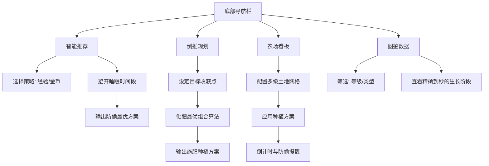

## 1. 产品概述
QQ农场种菜推荐工具是一个基于真实游戏数据的智能种植规划与收益优化引擎。
它旨在解决玩家在“防偷菜”、“最优化收益”以及“碎片时间管理”上的痛点。通过接入精确到秒的作物生长数据、多级土地加成逻辑及化肥催熟机制，为玩家计算出最符合其作息时间和收益目标（经验/金币）的个性化种植方案。

## 2. 核心功能

### 2.1 用户角色
| 角色 | 注册方式 | 核心权限 |
|------|----------|----------|
| 玩家 | 无需注册（本地缓存） | 使用智能种植推荐、倒推规划、农场收益模拟、图鉴查询功能 |

### 2.2 功能模块
本工具包含以下核心页面与模块：
1. **智能推荐页面**：根据当前时间、玩家作息及土地配置，推荐多维度的最佳种植方案。
2. **倒推规划页面**：根据目标收获时间反推种植方案，支持“化肥最优解”计算。
3. **农场模拟看板（新）**：支持配置真实农场土地分布，模拟并倒计时当前种植状态，提供防偷菜提醒。
4. **全景图鉴页面**：展示所有作物的详细参数（精确生长阶段、变异概率、经验/金币性价比）。
5. **偏好与配置页面**：配置玩家等级、真实土地分布、睡眠作息时间等核心参数。

### 2.3 页面详情
| 页面名称 | 模块名称 | 功能描述 |
|----------|----------|----------|
| 智能推荐 | 实时时间面板 | 显示当前时间，支持快捷选择“睡前种一波”、“上班种一波”等快捷场景 |
| 智能推荐 | 维度切换卡 | 允许用户选择推荐策略：“最高经验收益”、“最高金币收益”或“无缝衔接防偷” |
| 智能推荐 | 推荐方案卡片 | 展示推荐作物图标、总时长、预计收获时间、单季总收益、变异概率折算 |
| 倒推规划 | 目标时间选择器 | 选择期望的收获时间（精确到分钟） |
| 倒推规划 | 化肥策略推荐 | 当时间无法完美匹配时，智能计算出“最少成本的化肥使用组合”补齐时间差 |
| 农场看板 | 土地网格配置 | 模拟 4×6 或更大的农场网格，允许用户分别设置每块地的等级（普通/红/黑/金） |
| 农场看板 | 模拟种植与倒计时 | 将方案应用到看板，显示每块地的剩余成熟时间，支持网页端通知提醒（防偷菜） |
| 图鉴页面 | 数据检索与排序 | 支持按解锁等级、基础时长、经验性价比（Exp/Min）进行筛选和排序 |
| 设置页面 | 玩家等级过滤 | 输入当前等级，全局自动屏蔽尚未解锁的种子 |
| 设置页面 | 睡眠/作息保护 | 设置如“23:00 - 08:00”为睡眠期，推荐算法在此期间内自动排除会成熟的作物 |

## 3. 核心流程与算法逻辑

### 3.1 智能推荐流程（考虑作息保护）
1. 用户进入推荐页面，系统获取当前时间和用户配置的**睡眠时间段**。
2. 算法遍历所有**已解锁等级**的作物。
3. 应用**土地时间缩减加成**（红地0%、黑地10%、金地20%），精确计算实际生长秒数。
4. **作息碰撞检测**：若作物预计成熟时间落在“睡眠时间段”内，则大幅降低推荐权重或直接剔除（防止被偷）。
5. 根据用户选择的偏好（经验优先/金币优先），结合土地的**产量加成和经验加成**计算最终收益，输出Top 5方案。

### 3.2 倒推规划与化肥计算流程
1. 用户设定目标收获时间（例如：今晚 20:00 准时收菜）。
2. 系统反推剩余可用时长（例如：还剩 4小时30分）。
3. 寻找基础时间相近的作物。
4. **化肥最优解计算**：对于超出时间的作物，根据真实化肥数据（极速-2.5h，高速-1h，普通-20min），利用贪心算法计算出“卡点成熟且化肥消耗最少”的使用方案，并展示给用户。

### 3.3 农场看板使用流程
1. 用户在“设置”或“看板”初始化自己的真实土地构成（如：10块黑土地、14块红土地）。
2. 在推荐页选中某个方案，点击“应用到农场”。
3. 看板开始倒计时，并综合所有土地类型，精确展示这一波总共能收获多少经验、多少金币。
4. 接近成熟时（如提前5分钟），触发浏览器 Notification 提醒用户收菜。

## 4. 用户界面设计

### 4.1 设计风格
- **主色调**：农场生态绿（#4CAF50, #8BC34A），体现生机与自然。
- **辅助色**：
  - 丰收金（#FFB300）：用于强调高收益、金币数值。
  - 经验蓝（#29B6F6）：用于强调经验值、等级相关。
  - 警示红（#EF5350）：用于“即将成熟/防偷菜”的倒计时警告。
- **UI 框架**：使用 Tailwind CSS 进行现代化、原子化样式构建。
- **卡片化与数据可视化**：大量使用数据进度条、微型图表（如经验/时间比的雷达图或柱状条）来直观展示性价比。

### 4.2 响应式与交互体验
- **移动端优先 (Mobile First)**：考虑到玩家多在碎片时间使用手机查阅，界面采用单手易操作的底部导航（Bottom Tab Bar）。
- **快捷交互**：对于“作息时间”等高频操作，提供滑块或快捷胶囊按钮（如“睡8小时”、“睡6小时”）。
- **状态持久化**：使用 `localStorage` 或轻量级状态管理（Zustand）永久保存玩家的土地网格布局和等级设置，无需每次重新输入。

