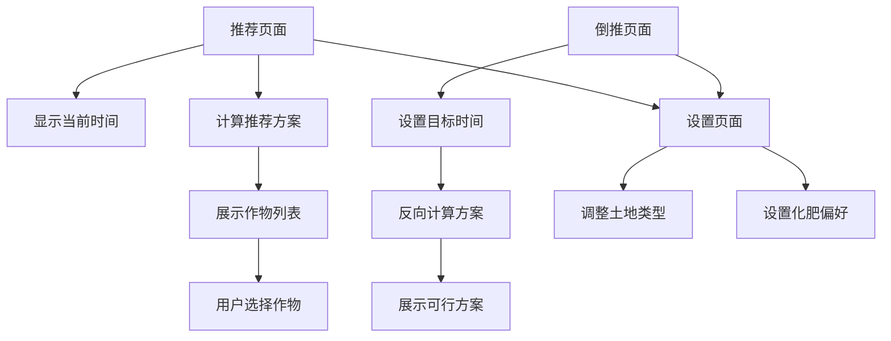

## 1. 产品概述
QQ农场种菜推荐工具是一个智能种植规划工具，帮助玩家根据时间安排最优种植方案。
通过算法计算，为玩家推荐最适合当前时间种植的作物，确保在期望时间收获，最大化游戏收益。

## 2. 核心功能

### 2.1 用户角色
| 角色 | 注册方式 | 核心权限 |
|------|----------|----------|
| 普通用户 | 无需注册 | 使用种植推荐、倒推规划功能 |

### 2.2 功能模块
本工具包含以下核心页面：
1. **推荐页面**：根据当前时间智能推荐最佳种植方案
2. **倒推页面**：根据目标收获时间反推种植方案
3. **作物列表页面**：展示所有作物的详细参数（生长时长、收益、季数等）
4. **设置页面**：配置土地类型、化肥使用等参数

### 2.3 页面详情
| 页面名称 | 模块名称 | 功能描述 |
|----------|----------|----------|
| 推荐页面 | 时间显示 | 实时显示当前时间，精确到分钟 |
| 推荐页面 | 作物推荐卡片 | 展示推荐作物的图标、名称、种植时长、预计收获时间 |
| 推荐页面 | 土地类型选择 | 切换普通土地/黑土地/金土地，实时更新推荐结果 |
| 推荐页面 | 化肥使用开关 | 开启/关闭化肥催熟功能 |
| 倒推页面 | 目标时间设置 | 选择期望的收获时间（精确到小时） |
| 倒推页面 | 推荐方案展示 | 显示多种可行的种植方案，包括作物类型、种植时间、预计收益 |
| 作物列表页面 | 作物检索 | 支持按名称或时长搜索作物 |
| 作物列表页面 | 作物详情列表 | 展示所有作物的图标、基础时长、季数、收益等核心参数 |
| 设置页面 | 土地等级设置 | 永久保存用户的土地类型偏好 |
| 设置页面 | 化肥使用偏好 | 设置是否默认使用化肥 |
| 设置页面 | 作物偏好 | 允许用户标记偏好或排除的作物类型 |

## 3. 核心流程

### 普通用户使用流程
1. 用户进入推荐页面，系统自动获取当前时间
2. 系统根据当前时间、土地类型、化肥设置计算最优种植方案
3. 展示推荐结果，包括多个作物选项及其详细信息
4. 用户可切换土地类型或化肥设置，实时更新推荐结果
5. 用户点击作物卡片查看详细种植计划

### 倒推规划流程
1. 用户进入倒推页面，设置目标收获时间
2. 系统反向计算可行的种植方案
3. 展示多个方案选项，包括种植时间、作物类型、预计收益
4. 用户选择最适合的方案进行种植

## 4. 用户界面设计

### 4.1 设计风格
- **主色调**：绿色系（#4CAF50, #8BC34A）体现农场主题
- **辅助色**：金黄色（#FFC107）表示收获，蓝色（#2196F3）表示时间
- **按钮样式**：圆角矩形，带有轻微阴影效果
- **字体**：主要使用微软雅黑，数字显示使用等宽字体
- **布局风格**：卡片式布局，清晰分隔不同功能区域
- **图标风格**：扁平化图标，使用农场相关元素（叶子、太阳、时钟等）

### 4.2 页面设计概述
| 页面名称 | 模块名称 | UI元素 |
|----------|----------|--------|
| 推荐页面 | 时间显示 | 大字体数字时钟，居中显示，背景为渐变色 |
| 推荐页面 | 作物卡片 | 横向排列的卡片，每个卡片包含作物图标、名称、时长标签 |
| 推荐页面 | 控制面板 | 底部固定栏，包含土地类型选择器和化肥开关 |
| 倒推页面 | 时间选择器 | 滚轮式时间选择器，精确到小时 |
| 倒推页面 | 方案列表 | 垂直列表，每个方案显示作物图标、种植时间、收获时间 |
| 作物列表页面 | 作物详情列表 | 列表式布局，每个作物项包含图标、名称、时长、收益等 |
| 设置页面 | 设置项 | 简洁的列表布局，开关按钮使用iOS风格 |

### 4.3 响应式设计
- **移动端优先**：主要面向手机用户，优化竖屏下的操作体验
- **响应式适配**：自动适配不同屏幕尺寸，在桌面端保持良好的视觉效果
- **交互设计**：采用底部导航栏切换主要页面，方便单手操作
- **触摸优化**：按钮和交互元素足够大，适合触摸操作

### 4.4 算法逻辑说明
- **时间计算**：考虑4/8/12/24小时作物，一季和二季作物的不同逻辑
- **土地加成**：黑土地减少10%时间，金土地减少20%时间
- **化肥机制**：一季作物5个阶段可施肥1次，二季作物收获后可再施肥1次
- **推荐算法**：优先推荐收益高、时间合适的作物，提供多个备选方案